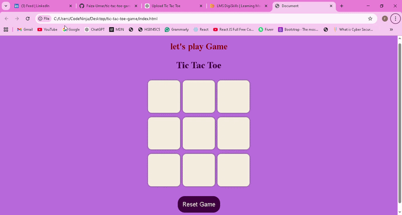
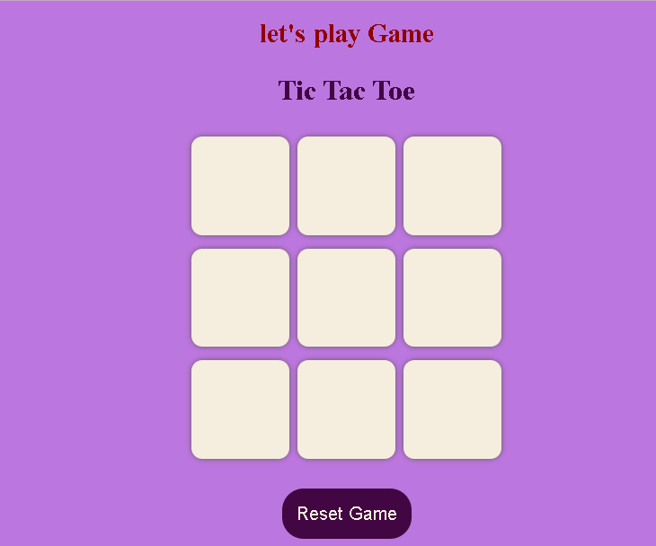

# tic-tac-toe-game

# Tic Tac Toe Game
 A simple interactive **Tic Tac Toe game** built with **HTML, CSS, and JavaScript**.  
This project demonstrates DOM manipulation and basic game logic.

---

## Gameplay Demo

---

## UI Preview

---

## Features

✔ Two-player gameplay  
✔ Win & Draw Detection  
✔ Restart Game Button  
✔ Responsive Design  
✔ Clean & Interactive UI  

---

## Technologies Used

- HTML5  
- CSS3  
- JavaScript (DOM Manipulation)

---

## Project Structure

tic-tac-toe-game
│
├── index.html
├── style.css
├── script.js
├── tic-tac-toe.gif
├── game.png
└── README.md

 
---

## What I Learned

 JavaScript Logic Building  
 Event Handling  
 DOM Manipulation  
 Game State Management  

---

## Author

**Faiza Umar**  
Frontend Developer  
